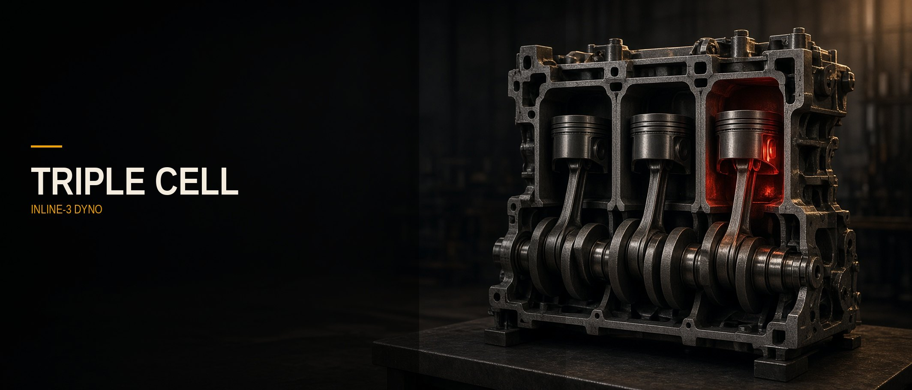

# Triple Cell

Even-fire inline-3 dyno and sound bench. Bore, stroke, compression, cam, intake, exhaust, and an optional turbo all feed the same motor: the power chart, the cutaway, the 3D view, and the exhaust note.

## Run

```bash
npm install
npm run dev
```

Then open the URL Vite prints (port 8080). Start the motor, tap Rev, and drag the 3D view to orbit. Double-click the 3D view to reset the camera.

## What’s in it

- Slider-crank inline-3, firing every 240° (1–2–3)
- Brake chart in kW and Nm, with altitude, temperature, and knock
- Live 2D cutaway and an orbitable 3D block on the same crank
- Web Audio exhaust, intake, and mechanical layers you can download as WAV
